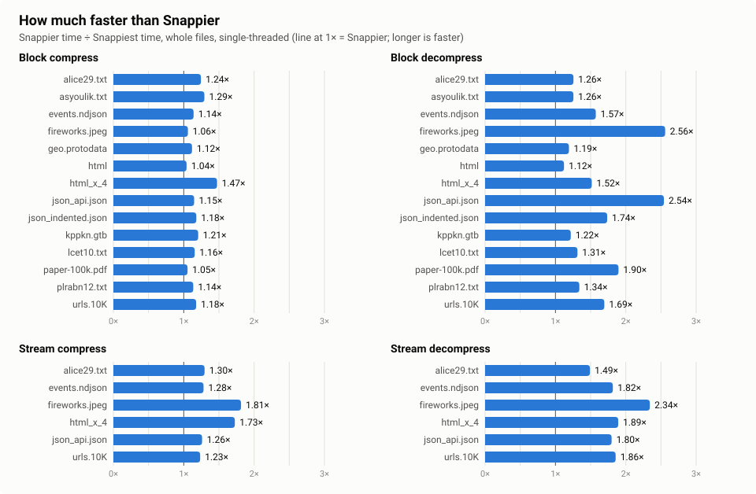
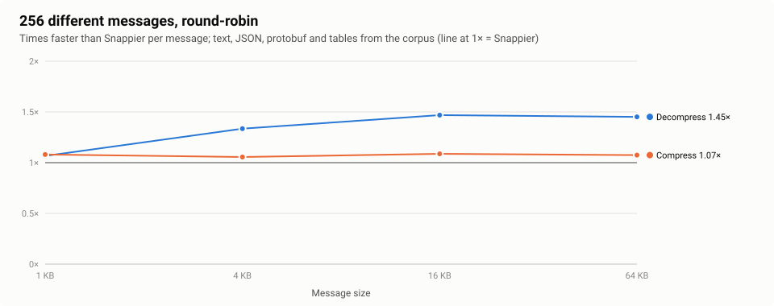
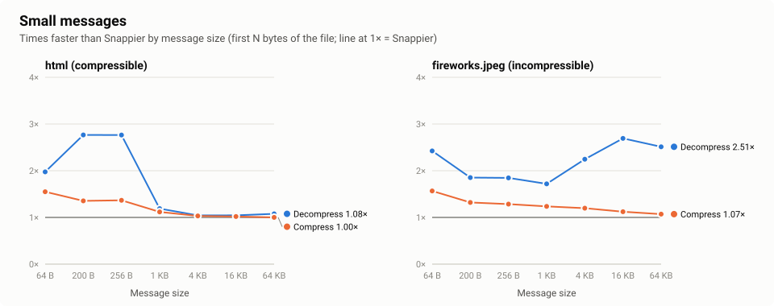
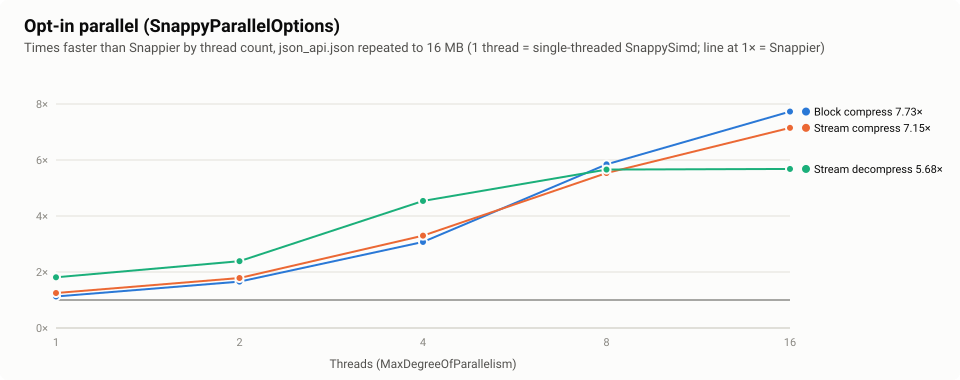

# SnappySimd

[](https://github.com/zcsizmadia/SnappySimd/actions/workflows/ci.yml)
[](https://zcsizmadia.github.io/SnappySimd/)
[](https://zcsizmadia.github.io/SnappySimd/)
[](https://www.nuget.org/packages/SnappySimd)
[](https://dotnet.microsoft.com/download)
[](LICENSE)

High-performance [Snappy](https://github.com/google/snappy) compression for .NET 8 and later, built on SIMD and
hardware intrinsics for x64 and arm64.

- **Faster than [Snappier](https://github.com/brantburnett/Snappier)** for both compression and decompression on the
  standard Snappy corpus (see [Benchmarks](#benchmarks)).
- **Drop-in replacement for Snappier**: same type names, members and exceptions. Change the namespace and you're done.
- Raw block format (`Snappy`) and framing/stream format (`SnappyStream`), interoperable with Snappier, google/snappy
  and every other conforming implementation.
- Pure managed code, no native dependencies, trimming and Native AOT compatible.

## Migrating from Snappier

```diff
- <PackageReference Include="Snappier" Version="1.3.1" />
+ <PackageReference Include="SnappySimd" Version="1.0.0" />
```

```diff
- using Snappier;
+ using SnappySimd;
```

That's all: `Snappy` and `SnappyStream` have the same members, parameter names and exception types as in Snappier.
Data compressed by either library decompresses with the other. The compressed bytes themselves are not guaranteed to
be identical to Snappier's (the compressed size is the same or smaller). They can also differ between machines: CPUs with a
CRC32 instruction use it as the hash function, others use a multiplicative hash. Every output is valid Snappy and
decodes everywhere.

Small behaviour differences, all on invalid input or edge cases:

| Situation | Snappier | SnappySimd |
| --- | --- | --- |
| Stream ends in the middle of a chunk | returns the partial data | throws `InvalidDataException` |
| Stream identifier chunk with wrong contents | ignored | throws `InvalidDataException` |
| `SnappyStream.Flush()` | writes buffered data | writes buffered data and flushes the base stream |
| Block header claims far more output than the input can produce | allocates, then fails | fails before allocating |
| Block whose tags overrun the declared length or the input (corrupt data) | may return data | throws `InvalidDataException`, like google/snappy |
| `SnappyStream.Read` | fills the whole buffer when possible | may return fewer bytes, like `DeflateStream` |

## Usage

### Blocks

```csharp
using SnappySimd;

byte[] compressed = Snappy.CompressToArray(data);
byte[] restored = Snappy.DecompressToArray(compressed);

// Span based, no allocations
Span<byte> buffer = new byte[Snappy.GetMaxCompressedLength(data.Length)];
int length = Snappy.Compress(data, buffer);

Span<byte> output = new byte[Snappy.GetUncompressedLength(buffer[..length])];
Snappy.Decompress(buffer[..length], output);

// Pooled buffers
using IMemoryOwner<byte> owner = Snappy.CompressToMemory(data);
```

### Streams

```csharp
using System.IO.Compression;
using SnappySimd;

using (var compressor = new SnappyStream(fileStream, CompressionMode.Compress))
{
    source.CopyTo(compressor);
}

using var decompressor = new SnappyStream(compressedStream, CompressionMode.Decompress);
decompressor.CopyTo(destination);
```

### Parallel compression and decompression (opt-in)

Snappy compresses 64KB fragments (blocks) and chunks (streams) independently, so large inputs can use several
threads. Pass `SnappyParallelOptions` to the extra overloads; the Snappier-compatible members never use more than the
calling thread. The output is **byte-for-byte identical** to the single-threaded output, so anything that reads
Snappy (Snappier, google/snappy, snappy-java, ...) reads it.

```csharp
var options = new SnappyParallelOptions { MaxDegreeOfParallelism = 8 }; // default: all processors

byte[] compressed = Snappy.CompressToArray(largeData, options);       // blocks: compression
int length = Snappy.Compress(largeData, outputBuffer, options);

using var writer = new SnappyStream(file, CompressionMode.Compress, leaveOpen: false, options);  // streams:
using var reader = new SnappyStream(file, CompressionMode.Decompress, leaveOpen: false, options); // both ways
```

Inputs below `MinimumParallelLength` (default 256KB) are processed on the calling thread. Raw block decompression is
always single-threaded: other encoders may emit copies that cross fragment boundaries. Neither Snappier nor
google/snappy has a parallel mode.

## How it is fast

- **Decompression** is a port of the branchless decoder from google/snappy 1.3: tags decode through a lookup table
  without data dependent branches, and each copy is deferred by one tag so its loads overlap with decoding the next.
  Output is written straight into the caller's buffer in a single pass (Snappier decodes into an internal buffer and
  copies). Overlapping copies expand their pattern with a byte shuffle (`PSHUFB` on x64, `TBL` on arm64).
- **Compression** follows google/snappy's `CompressFragment`, with branch-free tag emission, CRC32C hashing, and
  32-byte vector comparison for long matches.
- **Streams** decode each chunk directly into the caller's buffer when it fits, and verify checksums with hardware
  CRC-32C running three independent streams in parallel (about 3x the throughput of a single chain).

All SIMD paths have scalar fallbacks; the test suite runs with AVX2 disabled and with all hardware intrinsics
disabled to cover them.

## Benchmarks

AMD EPYC 7543 (Zen 3, AVX2), Ubuntu 22.04, BenchmarkDotNet 0.16 (medium job, in-process, one benchmark process per
physical core). Snappier 1.3.1 is the baseline; speedup is Snappier time / SnappySimd time. .NET 11 is RC 1. Raw block,
small-message and different-message results are the best of two runs for each library.

SnappySimd is at least as fast as Snappier in 179 of the 180 comparisons below (274 of 276 in the
[full results](docs/benchmarks/README.md)), and faster in all but a few ties. The exceptions are decompressing the
same 4 KB and 16 KB html block over and over on .NET 11 RC 1 (0.97-0.98x).

**Repeated block vs. different messages.** Most benchmarks here, like Snappier's and google/snappy's, decode one block
millions of times. The CPU's branch predictor then learns that block's whole tag sequence, which makes a branchy
decoder like Snappier's nearly mispredict-free (measured with `perf`: ~2 mispredictions per 1500 tags) and hides the
advantage of SnappySimd's branchless decoder. With 256 different messages per size, as in real traffic, SnappySimd
decompresses 1.3-1.6x faster than Snappier at 4-64 KB (1.0-1.2x at 1 KB).

<picture>
  <source media="(prefers-color-scheme: dark)" srcset="docs/benchmarks/speedup-dark.svg">
  
</picture>

<picture>
  <source media="(prefers-color-scheme: dark)" srcset="docs/benchmarks/messages-dark.svg">
  
</picture>

<picture>
  <source media="(prefers-color-scheme: dark)" srcset="docs/benchmarks/small-dark.svg">
  
</picture>

<picture>
  <source media="(prefers-color-scheme: dark)" srcset="docs/benchmarks/parallel-dark.svg">
  
</picture>

Charts are .NET 10; the tables cover all three runtimes.

#### Raw blocks (`Snappy.Compress` / `Snappy.Decompress`, whole file)

**Compress**

| Input | Snappier (net8.0) | SnappySimd (net8.0) | Speedup | Snappier (net10.0) | SnappySimd (net10.0) | Speedup | Snappier (net11.0) | SnappySimd (net11.0) | Speedup |
| --- | ---: | ---: | ---: | ---: | ---: | ---: | ---: | ---: | ---: |
| alice29.txt | 352 µs | 315 µs | **1.12x** | 331 µs | 287 µs | **1.15x** | 330 µs | 291 µs | **1.13x** |
| asyoulik.txt | 310 µs | 280 µs | **1.11x** | 296 µs | 254 µs | **1.16x** | 290 µs | 242 µs | **1.20x** |
| events.ndjson | 834 µs | 780 µs | **1.07x** | 784 µs | 745 µs | **1.05x** | 778 µs | 746 µs | **1.04x** |
| fireworks.jpeg | 4.1 µs | 4.1 µs | **1.01x** | 4.2 µs | 4.0 µs | **1.05x** | 4.3 µs | 4.0 µs | **1.09x** |
| geo.protodata | 42.5 µs | 38.8 µs | **1.10x** | 41.3 µs | 38.2 µs | **1.08x** | 41.2 µs | 37.8 µs | **1.09x** |
| html | 45.5 µs | 43.1 µs | **1.06x** | 43.3 µs | 42.9 µs | **1.01x** | 44.0 µs | 42.5 µs | **1.03x** |
| html_x_4 | 313 µs | 290 µs | **1.08x** | 285 µs | 246 µs | **1.16x** | 275 µs | 248 µs | **1.11x** |
| json_api.json | 839 µs | 779 µs | **1.08x** | 785 µs | 744 µs | **1.06x** | 783 µs | 738 µs | **1.06x** |
| json_indented.json | 467 µs | 446 µs | **1.05x** | 446 µs | 417 µs | **1.07x** | 438 µs | 417 µs | **1.05x** |
| kppkn.gtb | 276 µs | 253 µs | **1.09x** | 263 µs | 248 µs | **1.06x** | 263 µs | 242 µs | **1.09x** |
| lcet10.txt | 985 µs | 898 µs | **1.10x** | 951 µs | 868 µs | **1.10x** | 947 µs | 867 µs | **1.09x** |
| paper-100k.pdf | 7.4 µs | 7.0 µs | **1.07x** | 7.3 µs | 6.9 µs | **1.07x** | 7.3 µs | 6.9 µs | **1.06x** |
| plrabn12.txt | 1.33 ms | 1.21 ms | **1.10x** | 1.27 ms | 1.17 ms | **1.09x** | 1.28 ms | 1.15 ms | **1.11x** |
| urls.10K | 1.15 ms | 1.03 ms | **1.11x** | 1.09 ms | 1.04 ms | **1.05x** | 1.08 ms | 1.01 ms | **1.07x** |

**Decompress**

| Input | Snappier (net8.0) | SnappySimd (net8.0) | Speedup | Snappier (net10.0) | SnappySimd (net10.0) | Speedup | Snappier (net11.0) | SnappySimd (net11.0) | Speedup |
| --- | ---: | ---: | ---: | ---: | ---: | ---: | ---: | ---: | ---: |
| alice29.txt | 114 µs | 85.1 µs | **1.34x** | 110 µs | 86.1 µs | **1.28x** | 108 µs | 86.1 µs | **1.26x** |
| asyoulik.txt | 106 µs | 76.7 µs | **1.38x** | 102 µs | 80.8 µs | **1.27x** | 102 µs | 80.8 µs | **1.26x** |
| events.ndjson | 358 µs | 224 µs | **1.60x** | 345 µs | 216 µs | **1.59x** | 386 µs | 218 µs | **1.77x** |
| fireworks.jpeg | 6.4 µs | 2.5 µs | **2.60x** | 6.4 µs | 2.5 µs | **2.60x** | 6.4 µs | 2.5 µs | **2.60x** |
| geo.protodata | 22.4 µs | 17.5 µs | **1.28x** | 22.5 µs | 18.0 µs | **1.25x** | 20.7 µs | 18.0 µs | **1.15x** |
| html | 22.3 µs | 21.0 µs | **1.06x** | 23.4 µs | 20.7 µs | **1.13x** | 22.2 µs | 20.8 µs | **1.07x** |
| html_x_4 | 122 µs | 84.2 µs | **1.44x** | 125 µs | 84.1 µs | **1.49x** | 116 µs | 84.2 µs | **1.38x** |
| json_api.json | 564 µs | 218 µs | **2.59x** | 564 µs | 217 µs | **2.60x** | 380 µs | 217 µs | **1.75x** |
| json_indented.json | 224 µs | 131 µs | **1.72x** | 220 µs | 124 µs | **1.77x** | 211 µs | 125 µs | **1.68x** |
| kppkn.gtb | 108 µs | 92.1 µs | **1.17x** | 112 µs | 92.7 µs | **1.21x** | 101 µs | 91.9 µs | **1.10x** |
| lcet10.txt | 323 µs | 228 µs | **1.42x** | 308 µs | 228 µs | **1.35x** | 317 µs | 228 µs | **1.39x** |
| paper-100k.pdf | 6.9 µs | 3.8 µs | **1.83x** | 7.2 µs | 3.8 µs | **1.91x** | 6.8 µs | 3.7 µs | **1.84x** |
| plrabn12.txt | 467 µs | 309 µs | **1.51x** | 436 µs | 319 µs | **1.37x** | 436 µs | 328 µs | **1.33x** |
| urls.10K | 398 µs | 224 µs | **1.78x** | 389 µs | 224 µs | **1.73x** | 383 µs | 228 µs | **1.68x** |

#### Whole corpus in one operation (all files)

**Compress**

| Input | Snappier (net8.0) | SnappySimd (net8.0) | Speedup | Snappier (net10.0) | SnappySimd (net10.0) | Speedup | Snappier (net11.0) | SnappySimd (net11.0) | Speedup |
| --- | ---: | ---: | ---: | ---: | ---: | ---: | ---: | ---: | ---: |
| all files | 7.60 ms | 7.03 ms | **1.08x** | 7.30 ms | 6.89 ms | **1.06x** | 7.30 ms | 6.91 ms | **1.06x** |

**Decompress**

| Input | Snappier (net8.0) | SnappySimd (net8.0) | Speedup | Snappier (net10.0) | SnappySimd (net10.0) | Speedup | Snappier (net11.0) | SnappySimd (net11.0) | Speedup |
| --- | ---: | ---: | ---: | ---: | ---: | ---: | ---: | ---: | ---: |
| all files | 3.02 ms | 1.85 ms | **1.63x** | 2.87 ms | 1.77 ms | **1.62x** | 2.77 ms | 1.82 ms | **1.53x** |

#### 256 different messages of each size, round-robin (time per message)

**Compress**

| Input | Snappier (net8.0) | SnappySimd (net8.0) | Speedup | Snappier (net10.0) | SnappySimd (net10.0) | Speedup | Snappier (net11.0) | SnappySimd (net11.0) | Speedup |
| --- | ---: | ---: | ---: | ---: | ---: | ---: | ---: | ---: | ---: |
| 1024 B | 1.4 µs | 1.3 µs | **1.09x** | 1.3 µs | 1.2 µs | **1.08x** | 1.3 µs | 1.2 µs | **1.09x** |
| 4096 B | 6.3 µs | 6.0 µs | **1.05x** | 6.2 µs | 5.9 µs | **1.06x** | 6.1 µs | 5.8 µs | **1.05x** |
| 16384 B | 27.6 µs | 25.3 µs | **1.09x** | 26.9 µs | 24.7 µs | **1.09x** | 26.7 µs | 24.7 µs | **1.08x** |
| 65536 B | 109 µs | 100 µs | **1.08x** | 105 µs | 98.0 µs | **1.07x** | 105 µs | 97.5 µs | **1.07x** |

**Decompress**

| Input | Snappier (net8.0) | SnappySimd (net8.0) | Speedup | Snappier (net10.0) | SnappySimd (net10.0) | Speedup | Snappier (net11.0) | SnappySimd (net11.0) | Speedup |
| --- | ---: | ---: | ---: | ---: | ---: | ---: | ---: | ---: | ---: |
| 1024 B | 518 ns | 434 ns | **1.19x** | 447 ns | 419 ns | **1.07x** | 422 ns | 423 ns | **1.00x** |
| 4096 B | 2.5 µs | 1.7 µs | **1.46x** | 2.2 µs | 1.7 µs | **1.34x** | 2.2 µs | 1.7 µs | **1.30x** |
| 16384 B | 10.6 µs | 6.5 µs | **1.64x** | 9.4 µs | 6.4 µs | **1.47x** | 9.3 µs | 6.4 µs | **1.44x** |
| 65536 B | 41.3 µs | 25.9 µs | **1.60x** | 36.9 µs | 25.4 µs | **1.45x** | 36.6 µs | 25.7 µs | **1.43x** |

#### Small messages (`Snappy`, first N bytes of the file)

**Compress**

| Input | Snappier (net8.0) | SnappySimd (net8.0) | Speedup | Snappier (net10.0) | SnappySimd (net10.0) | Speedup | Snappier (net11.0) | SnappySimd (net11.0) | Speedup |
| --- | ---: | ---: | ---: | ---: | ---: | ---: | ---: | ---: | ---: |
| html 64 B | 110 ns | 64 ns | **1.72x** | 89 ns | 58 ns | **1.55x** | 84 ns | 58 ns | **1.44x** |
| html 1024 B | 916 ns | 742 ns | **1.24x** | 855 ns | 765 ns | **1.12x** | 848 ns | 746 ns | **1.14x** |
| html 4096 B | 3.4 µs | 3.0 µs | **1.11x** | 3.2 µs | 3.1 µs | **1.03x** | 3.2 µs | 3.0 µs | **1.06x** |
| html 65536 B | 32.9 µs | 31.1 µs | **1.06x** | 31.8 µs | 31.7 µs | **1.00x** | 32.9 µs | 30.8 µs | **1.07x** |

**Decompress**

| Input | Snappier (net8.0) | SnappySimd (net8.0) | Speedup | Snappier (net10.0) | SnappySimd (net10.0) | Speedup | Snappier (net11.0) | SnappySimd (net11.0) | Speedup |
| --- | ---: | ---: | ---: | ---: | ---: | ---: | ---: | ---: | ---: |
| html 64 B | 80 ns | 42 ns | **1.91x** | 75 ns | 38 ns | **1.98x** | 58 ns | 39 ns | **1.48x** |
| html 1024 B | 306 ns | 255 ns | **1.20x** | 293 ns | 247 ns | **1.19x** | 265 ns | 260 ns | **1.02x** |
| html 4096 B | 1.4 µs | 1.3 µs | **1.04x** | 1.4 µs | 1.3 µs | **1.04x** | 1.3 µs | 1.3 µs | **0.98x** |
| html 65536 B | 16.1 µs | 15.2 µs | **1.06x** | 16.3 µs | 15.1 µs | **1.08x** | 15.3 µs | 15.1 µs | **1.01x** |

**RoundTripArray**

| Input | Snappier (net8.0) | SnappySimd (net8.0) | Speedup | Snappier (net10.0) | SnappySimd (net10.0) | Speedup | Snappier (net11.0) | SnappySimd (net11.0) | Speedup |
| --- | ---: | ---: | ---: | ---: | ---: | ---: | ---: | ---: | ---: |
| html 64 B | 251 ns | 161 ns | **1.56x** | 210 ns | 145 ns | **1.45x** | 181 ns | 137 ns | **1.32x** |
| html 1024 B | 1.4 µs | 1.2 µs | **1.17x** | 1.3 µs | 1.2 µs | **1.13x** | 1.3 µs | 1.2 µs | **1.09x** |
| html 4096 B | 5.3 µs | 4.9 µs | **1.08x** | 5.1 µs | 4.8 µs | **1.04x** | 5.0 µs | 4.9 µs | **1.02x** |
| html 65536 B | 55.2 µs | 49.4 µs | **1.12x** | 53.3 µs | 48.4 µs | **1.10x** | 54.6 µs | 48.5 µs | **1.13x** |

#### Streams (`SnappyStream`, whole file)

**Compress**

| Input | Snappier (net8.0) | SnappySimd (net8.0) | Speedup | Snappier (net10.0) | SnappySimd (net10.0) | Speedup | Snappier (net11.0) | SnappySimd (net11.0) | Speedup |
| --- | ---: | ---: | ---: | ---: | ---: | ---: | ---: | ---: | ---: |
| alice29.txt | 373 µs | 325 µs | **1.15x** | 356 µs | 298 µs | **1.19x** | 358 µs | 300 µs | **1.19x** |
| fireworks.jpeg | 24.8 µs | 14.2 µs | **1.74x** | 25.5 µs | 13.2 µs | **1.93x** | 24.2 µs | 12.2 µs | **1.98x** |
| html_x_4 | 367 µs | 314 µs | **1.17x** | 331 µs | 260 µs | **1.27x** | 340 µs | 262 µs | **1.30x** |
| json_api.json | 983 µs | 833 µs | **1.18x** | 915 µs | 776 µs | **1.18x** | 908 µs | 776 µs | **1.17x** |
| urls.10K | 1.27 ms | 1.07 ms | **1.19x** | 1.18 ms | 1.06 ms | **1.11x** | 1.18 ms | 1.05 ms | **1.13x** |

**Decompress**

| Input | Snappier (net8.0) | SnappySimd (net8.0) | Speedup | Snappier (net10.0) | SnappySimd (net10.0) | Speedup | Snappier (net11.0) | SnappySimd (net11.0) | Speedup |
| --- | ---: | ---: | ---: | ---: | ---: | ---: | ---: | ---: | ---: |
| alice29.txt | 143 µs | 92.9 µs | **1.53x** | 143 µs | 91.7 µs | **1.56x** | 138 µs | 91.8 µs | **1.50x** |
| fireworks.jpeg | 19.7 µs | 10.0 µs | **1.97x** | 19.1 µs | 8.7 µs | **2.18x** | 19.2 µs | 8.1 µs | **2.36x** |
| html_x_4 | 184 µs | 102 µs | **1.81x** | 186 µs | 95.7 µs | **1.94x** | 177 µs | 95.6 µs | **1.85x** |
| json_api.json | 456 µs | 274 µs | **1.67x** | 455 µs | 252 µs | **1.81x** | 436 µs | 249 µs | **1.75x** |
| urls.10K | 494 µs | 265 µs | **1.86x** | 475 µs | 251 µs | **1.90x** | 470 µs | 250 µs | **1.88x** |

Reproduce with `scripts/bench-remote.sh` (or run `benchmarks/SnappySimd.Benchmarks` directly with BenchmarkDotNet).

## Building and testing

```shell
dotnet build -c Release
dotnet test --project tests/SnappySimd.Tests -c Release
scripts/coverage.sh        # coverage across CPU feature configurations
```

Tests use [TUnit](https://github.com/thomhurst/TUnit) and include interop tests against Snappier, corruption fuzzing,
and guard-page tests that crash on any out-of-bounds access.

The fuzz tests (`tests/SnappySimd.Tests/Fuzz`) generate realistic and corrupt inputs and compare SnappySimd with
Snappier and a plain spec decoder. They run for about a second each in normal test runs; set `SNAPPY_FUZZ_SECONDS`
for longer runs (the nightly workflow does) and `SNAPPY_FUZZ_SEED` to replay a reported failure:

```shell
SNAPPY_FUZZ_SECONDS=300 dotnet test --project tests/SnappySimd.Tests -c Release -- --treenode-filter "/*/*/*FuzzTests/*"
```

## License

BSD-3-Clause. The compression and decompression loops are ported from
[google/snappy](https://github.com/google/snappy) (BSD-3-Clause, copyright Google Inc.).
